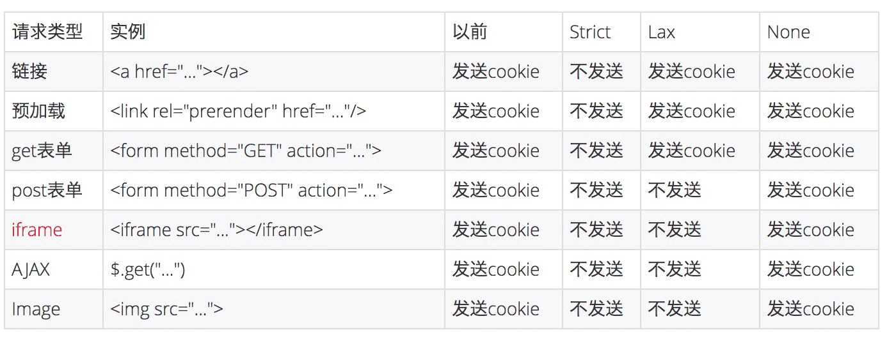

# 常见前端网络攻击
> [浏览器系列之 Cookie 和 SameSite 属性](https://github.com/mqyqingfeng/Blog/issues/157)
>[前端安全系列（一）：如何防止XSS攻击？](https://tech.meituan.com/2018/09/27/fe-security.html)
> [前端安全系列（二）：如何防止CSRF攻击？](https://tech.meituan.com/2018/10/11/fe-security-csrf.html)
### 一、XSS —— 跨站脚本攻击
### 二、CSRF —— 跨站请求伪造
#### 1. 是什么
- 受害者登录a.com，登陆并产生登录凭证（Cookie）。
- 攻击者引诱受害者访问b.com, 从而拿到受害者的登录凭证（Cookie）
- b.com 向 a.com 发送了一个请求：a.com/act=xx。浏览器会默认携带a.com的Cookie。
- a.com接收到请求后，对请求进行验证，并确认是受害者的凭证，误以为是受害者自己发送的请求。
- a.com以受害者的名义执行了act=xx。
- 攻击完成，攻击者在受害者不知情的情况下，冒充受害者，让a.com执行了自己定义的操作。
- 大致分为：GET类型的CSRF, POST类型的CSRF(一个自动提交的表单), 

#### 2. 如何解决
- 后端验证请求头的referer(直接输入地址没有referer), 缺点如下
  - 用户可以自己设置不带referer，会被误认为是crsf
  - referer可能被篡改
- Chrome 80浏览器的SameSite属性默认为Lax(Chrome 51新增该属性，之前默认为None)，对cookie携带做了限制。
  - Strict 仅允许一方请求携带 Cookie，即浏览器将只发送相同站点请求的 Cookie，即当前网页 URL 与请求目标 URL 完全一致。
  - Lax 允许部分第三方请求携带 Cookie
  - None 无论是否跨站都会发送 Cookie
  

### 三、SQL注入

#### 1. 是什么
原sql
```sql
const sql = `select * from user where username='${username}' and password='${password}'`
```
前端输入
```javascript
username-Input: xxx' or '1=1
password-Input: xxx or '1=1
```
发生SQL注入式攻击，现sql为
```sql
select * from user where username='xxx' or '1=1' and password='xxx' or '1=1'
```
#### 2. 如何解决
- 前端做输入校验，如：不允许输入特殊字符
- 后端对关键字符做转换，如：mysql.escape(xxxx)


https://blog.csdn.net/duninet/article/details/111171699


# react
JSX 防止注入攻击
你可以安全地在 JSX 当中插入用户输入内容：

```js
// 直接使用是安全的：
const title = response.potentiallyMaliciousInput;
const element = <h1>{title}</h1>;
```

React DOM 在渲染所有输入内容之前，默认会进行转义。它可以确保在你的应用中，永远不会注入那些并非自己明确编写的内容。所有的内容在渲染之前都被转换成了字符串。这样可以有效地防止 XSS（cross-site-scripting, 跨站脚本）攻击。


必须要转译的字符
 1)  &lt; (<)
 2)  &gt; (>)
 3)  &amp; (&)
 https://stackoverflow.com/questions/7381974/which-characters-need-to-be-escaped-in-html