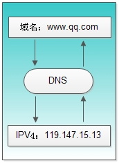

# DNS
### 什么是DNS
DNS(Domain Name System)即“域名系统”，主要实现域名和IP的映射，如我们可以通过14.215.177.39访问百度，也可以通过https://www.baidu.com 访问百度，具体可以理解为下图

### 相关概念
真正的网址应当是https://www.baidu.com. ,只不过.大家统一有，所以省略了
|  名称类型   | 说明  | 示例  | 备注 |
|  ----  | ----  |  ----  | ----  |
|  根域名  | ----  | 单个符号. | / |
|  顶级域名TLD  | 单元格 | .com. | 也叫一级域名 |
|  二级域名  | 单元格 | baidu.com. | / |
|  三级域名  | 单元格 | www.baidu.com. | www是主机名 |
- Public Suffix(公共后缀) === eTLD(有效顶级域名)，github.io、com.cn这种都属于eTLD，[完整的eTLD列表](https://publicsuffix.org/list/public_suffix_list.dat)，具体解释详见“浏览器存储”章节，可用于跨站划分。

### 解析过程
- 访问https://www.baidu.com/
- 浏览器搜索自己的DNS缓存
- DNS客户端服务
- 查询本机DNS缓存
- [DNS 为什么使用 UDP 协议作为传输层协议?]
记录类型
DNS劫持
  - [5.3.12. 网站域名加 www 与不加 www 的区别?]