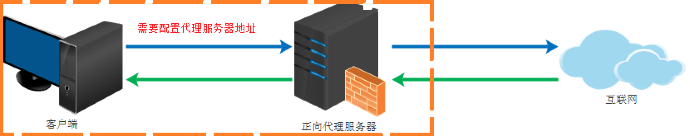
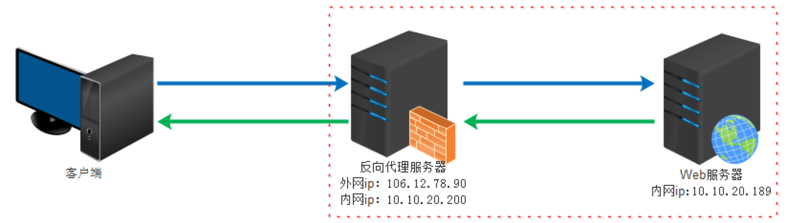

# Proxy —— 代理
### 什么是代理
一般指代理服务器，类似于中介的存在，分正向代理和反向代理

### 正向代理 和 反向代理

- 正向代理：我们作为用户，如访问Google，由于政策限制，需要我们的请求先访问“正向代理服务器”，再由“正向代理服务器”访问Google。
- 反向代理：我们作为开发者，有很多请求从Internet过来，先让这些请求经过“反向代理服务器”，“反向代理服务器”再将请求转发给我们的服务器。
- 正向代理隐藏的是用户，反向代理隐藏的是服务器。

### 运用
正向代理：翻墙、跨域、隐藏客户端IP等
反向代理：负载均衡、跨域、隐藏服务端IP等
