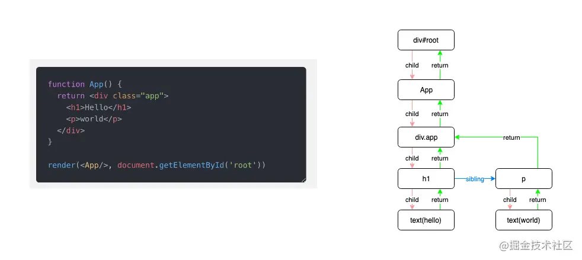

# Fiber
> https://juejin.cn/post/6844903975112671239?share_token=76f60826-6505-4904-8e26-051bad29181a

- JS引擎线程是单线程的，且和GUI线程互斥，如果有长任务霸占JS引擎线程，后面的js无法执行、页面无法渲染
- React 的 Reconcilation 就是长任务，react15的时候由于Reconcilation计算量过大会导致页面渲染掉帧
- 所以16使用了Fiber架构：Reconcilation 过程变成可被中断。


- 不卡顿: 每秒绘制不少于60帧，即16ms一帧。
- 浏览器: 处理绘制等行为之后还有盈余时间，就会调用“requestIdleCallback的回调”(避免饿死还可以根据优先级设置超时时间)，将剩余时间片交给React
- React: 使用完时间片将控制权主动交还浏览器
  - 将任务拆分成一个个执行单元Fiber，每执行完一个Fiber，React 就会检查现在还剩多少时间，如果没有时间就将控制权给浏览器.
  - React自己实现了一套“requestIdleCallback”
  - ```js
      // 用户调用 setState 更新组件, 这个待更新的任务会先放入队列中, 然后通过 requestIdleCallback 请求浏览器调度
      // 浏览器空闲的时候就会调用“requestIdleCallback的回调”即performWork
      updateQueue.push(updateTask);
      requestIdleCallback(performWork, {timeout});
    ```
  - ```js
      // 1️⃣ performWork 会拿到一个Deadline，表示剩余时间
      function performWork(deadline) {

      // 2️⃣ 循环取出updateQueue中的任务
      while (updateQueue.length > 0 && deadline.timeRemaining() > ENOUGH_TIME) {
        workLoop(deadline);
      }

      // 3️⃣ 如果在本次执行中，未能将所有任务执行完毕，那就再请求浏览器调度
      if (updateQueue.length > 0) {
        requestIdleCallback(performWork);
      }
    }
    ```
- 饿死：采用某种调度方法，某个任务一直被其他任务插队得不到执行。


- React 15 到 16的改造
  - 数据结构变化
    - v15用的是Satck Reconcilation，同步、递归执行，不好中断。V16将数据结构从stack改为链表，将递归转为迭代的方式，模拟栈，方便中断和继续执行。
    - 每个节点被保存为一个Fiber，Fiber：child、sibling、return
    - 
  - 两个阶段
    - Render(Reconcilation)阶段: diff在此阶段执行，可以打断，对需要变更(即有副作用，节点更新、删除、移动)的节点打上Tag，并且副作用也保存为链表。
      - constructor
      - componentWillMount、componentWillReceiveProps、componentWillUpdate（废弃）
      - static getDerivedStateFromProps
      - shouldComponentUpdate
      - render
    - Pre-Commit提交阶段: getSnapshotBeforeUpdate
    - Commit提交阶段: 将上阶段计算出来的需要处理的**副作用(Effects)**一次性执行了。这个阶段必须同步执行，不能被打断(毕竟要按正确的顺序执行副作用)
      - componentDidMount
      - componentDidUpdate
      - componentWillUnmount
  - ！！Reconcilation阶段可能被中断、恢复，甚至重做。所以协调阶段的生命周期钩子可能会被调用多次! 因此建议协调阶段的生命周期钩子不要包含副作用。索性 React 就废弃了这部分可能包含副作用的生命周期方法 —— 3个Will

