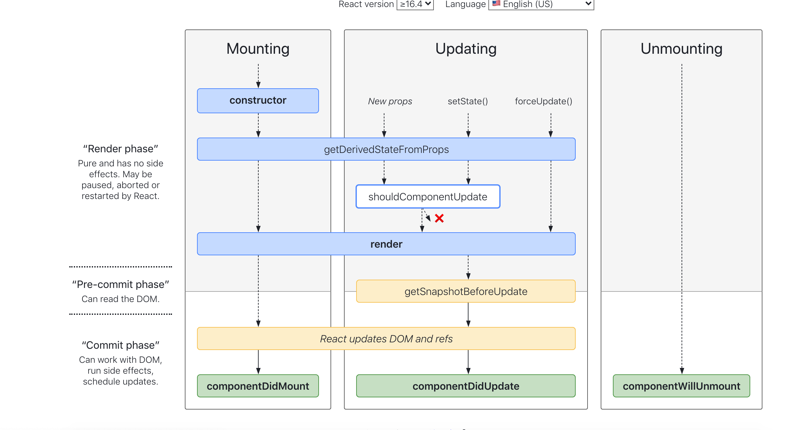

# React生命周期

- 当渲染过程，生命周期，或子组件的构造函数中抛出错误时，会调用如下方法：
  - static getDerivedStateFromError()
  - componentDidCatch()
- getDerivedStateFromProps —— 让组件在 props 变化时更新 state
- getSnapshotBeforeUpdate —— 在发生更改之前从 DOM 中捕获一些信息给...DidUpdate