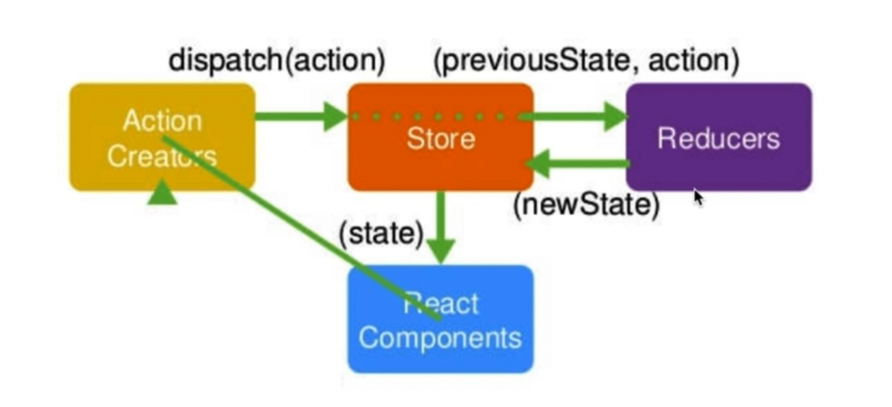

- 为什么要用redux
  - react只是一个视图层的框架，react是单向数据流，当应用比较大的时候状态、数据管理会很麻烦。 
  - 引入redux后，原来的组件数据传递由store统一维护，store里的值变了后，相应的组件会重新从store取值

- redux工作流
  - 
  - 组件要获取/改变store的数据，会先创建一个action，
  - 把action dispatch 给store
  - store会把当前的state把action的结果传给reducer？？
  - reducer 返回新的state给store
  - 组件会subscribe store，store变化后会执行相对应的回调函数进行更新

- redux原则
  - store唯一
  - 只有store能改变自己的数据(reducer只是返回newState给store)
  - reducer是个纯函数 —— 固定的输入会有固定的输出，且不会有任何副作用，所以ajax或者设置localstorage都不应该放到store

- 重点API
  - createStore
  - store.dispatch —— 派发action
  - store.getState —— 获取store数据
  - store.subscribe —— 订阅store的变化

- 如何发ajax请求，rudux中间件！，使用redux-thunk中间件，作为createStore的第二个参数 

- react-redux
  - 方便在react里使用redux
  - 核心API：Provider、connect
  - Provider给被包裹的组件提供一个可以链接store的能力
  - connect（mapStateToProps，mapDispatchToProps）：连接组件和store，根据mapStateToProps去做链接，把store里的数据映射到组件的props里去。根据mapDispatchToProps，把store.dispatch挂载到props上

- redux-thunk使得action（本来只能是一个对象）可以是一个函数，使用action-dispacth的时候，action会自动被执行。store只能接收一个对象action，thunk会执行函数
- 什么事redux中间件
  - 对dispatch方法的封装和升级
redux原理
  - 相当于reducer + flux(最初官方推出的数据管理框架)
mobx原理
redux和mobx的区别
reducer+context能不能代替redux 
imxxx
- 其他
  - 为什么要把Action Types另外拆出：减少错误，如果写错会报错。
  - actionCreators：把action的创建封装起来