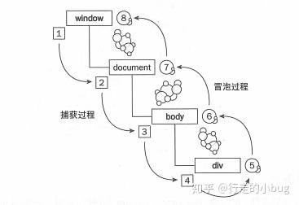

# 事件机制
> http://article.docway.net/details?id=60726b080a6c640f8b461168
- JS事件机制
  - 捕获阶段、处于目标阶段、事件冒泡阶段
  - 
  - element.addEventListener(event, function, useCapture) —— useCapture：默认false，true在捕获时执行，false在冒泡时执行。


  - 原生能阻止合成
  - 合成能阻止原生么


- 流程
  - 分为代理事件（DelegatedEvent）和不需要代理事件（NonDelegatedEvent）
    - ？

- 代理事件流程
  - ReactDOM.render里会监听所有需要代理的事件```listenToAllSupportedEvents(rootContainerElement);```
  - listenToAllSupportedEvents ——> listenToNativeEvent
    ```js
      // allNativeEvents 所有的原生事件
      allNativeEvents.forEach(domEventName => {
        if (domEventName !== 'selectionchange') {
          if (!nonDelegatedEvents.has(domEventName)) {
            // 需要事件代理
            listenToNativeEvent(domEventName, false, rootContainerElement); // 冒泡阶段监听
          }
          listenToNativeEvent(domEventName, true, rootContainerElement); // 捕获阶段监听
        }
      });

      export function listenToNativeEvent(
        domEventName: DOMEventName,
        isCapturePhaseListener: boolean,
        target: EventTarget,
      ): void {
        let eventSystemFlags = 0;
        if (isCapturePhaseListener) {
          // 按位或， 0 | false = 0，  0 | true = 1，
          eventSystemFlags |= IS_CAPTURE_PHASE;
        }
        addTrappedEventListener(
          target,
          domEventName,
          eventSystemFlags,
          isCapturePhaseListener,
        );
      }

      function addTrappedEventListener(
        targetContainer: EventTarget, // 根结点
        domEventName: DOMEventName, // 某一个原生事件
        eventSystemFlags: EventSystemFlags, // 1 冒泡阶段监听，0 捕获阶段监听
        isCapturePhaseListener: boolean, // 1 冒泡阶段监听，0 捕获阶段监听
        isDeferredListenerForLegacyFBSupport?: boolean,
      ) {
        // 
        let listener = createEventListenerWrapperWithPriority(
          targetContainer, // root
          domEventName, // 某一个原生事件名
          eventSystemFlags, // 1 冒泡阶段监听，0 捕获阶段监听
        );

        let unsubscribeListener;
        if (isCapturePhaseListener) {
          unsubscribeListener = addEventCaptureListener(
            targetContainer,
            domEventName,
            listener,
          );
        } else {
          unsubscribeListener = addEventBubbleListener(
            targetContainer,
            domEventName,
            listener,
          );
        }
      }

      export function addEventBubbleListener(
        target: EventTarget,
        eventType: string,
        listener: Function,
      ): Function {
        target.addEventListener(eventType, listener, false);
        return listener;
      }

      export function addEventCaptureListener(
        target: EventTarget,
        eventType: string,
        listener: Function,
      ): Function {
        target.addEventListener(eventType, listener, true);
        return listener;
      }
    ```
  - React将事件根据优先级分为3种类型——discreteEvent、userBlockingEvent、continuousEvent，```createEventListenerWrapperWithPriority```会根据不同的类型产生不同的listener
    ```js
    switch (eventPriority) {
      case DiscreteEventPriority:
        listenerWrapper = dispatchDiscreteEvent;
        break;
      case ContinuousEventPriority:
        listenerWrapper = dispatchContinuousEvent;
        break;
      case DefaultEventPriority:
      default:
        listenerWrapper = dispatchEvent;
        break;
    }
    ```

react 16 到 17 的变更
  - react 16 使用了事件池，方便事件复用，事件逻辑一旦执行完毕，开发者就拿不到事件对象了。17废弃了事件池，原先如果在onClick等之中使用setTimeout，setTimeout里获取event对象会报错，因为事件已经被回收了，需要在setTimeout之前调用e.persist()
  - react 17 事件统一由root管理，所以可以对document进行阻止冒泡，可以多版本并存，支持微前端架构

其他
  - 阻止 React 事件冒泡的行为只能用于 React 合成事件系统中，且没办法阻止原生事件的冒泡。

