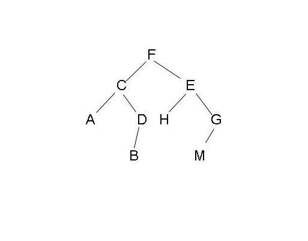

# 总结
### 树的遍历
```javascript
// 树结构 -- 普通树，对应图一
tree = {
  val: 'F',
  children: [{
    val: 'C',
    children: [{
      val: 'A',
      children: []
    }, {
      val: 'D',
      children: [{
        val: 'B',
        children: []
      }]
    }]
  }, {
    val: 'E',
    children: [{
      val: 'H',
      children: [],
    }, {
      val: 'G',
      children: [{
        val: 'M',
        children: []
      }]
    }]
  }]
}
// 树结构 -- 二叉树，对应图二
tree = {
  val: 'F',
  children: [{
    val: 'C',
    children: [{
      val: 'A',
      children: []
    }, {
      val: 'D',
      children: [{
        val: 'B',
        children: []
      }]
    }]
  }, {
    val: 'E',
    children: [{
      val: 'H',
      children: [],
    }, {
      val: 'G',
      children: [{
        val: 'M',
        children: []
      }]
    }]
  }]
}
```

- 深度优先遍历：FCADBEHGM
- 广度优先遍历：FCEADHGBM
- 中序遍历: ACBDFHEMG
- 先序遍历:FCADBEHGM
- 后序遍历: ABDCHMGEF
### 深度优先遍历DFS
#### 步骤
- 访问根结点
- 对根节点的children挨个深度优先遍历
#### 递归实现

### 广度优先遍历BFS
#### 步骤
- 新建一个队列，根结点入队
- 队头出队，并访问
- 队头的children挨个入队
- 重复2，3步，直至队列为空


### 先序遍历
#### 步骤
- 访问根节点
- 对根节点左子树进行先序遍历
- 对根节点右子树进行先序遍历

### 中序遍历
#### 步骤
- 对根节点左子树进行中序遍历
- 访问根节点
- 对根节点右子树进行中序遍历


### 后序遍历
#### 步骤
- 对根节点左子树进行后序遍历
- 对根节点右子树进行后序遍历
- 访问根节点
